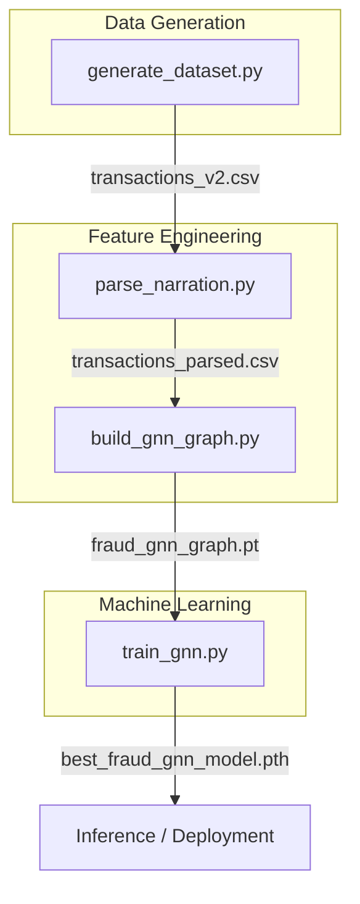

# 🏗️ AML GNN: Developer Onboarding & Pipeline Flow

Welcome to the **Anti-Money Laundering (AML) Graph Neural Network (GNN)** project! This guide explains the hidden mechanics of our fraud detection pipeline to help you understand, maintain, and extend it.

---

## 🏛️ System Architecture

Our system is built on a "Generate-Parse-Graph-Train" (GPGT) architecture.



---

## 🌊 Data Pipeline Flow

### 1️⃣ Generation (`generate_dataset.py`)
Produces synthetic banking data. Unlike simple random generators, this script uses **behavioral templates** to inject 10 distinct fraud patterns.
- **Input:** Config parameters (num_accounts, seeds).
- **Core Logic:** Uses `Account Factory` and `Transaction Factory` with `jitter` to prevent overfitting to exact timestamps.
- **Output:** `transactions_v2.csv` (Raw fields: `txn_id`, `amount`, `timestamp`, `narration`, `label`).

### 2️⃣ Parsing (`parse_narration.py`)
Banking narrations contain embedded metadata. This step extracts structured features.
- **Logic:** Regex/Split-based parsing of UPI/IMPS/APP strings.
- **Feature Extraction:** Extracts `receiver_account`, `receiver_mobile`, `receiver_name`, and `channel`.
- **Output:** `transactions_parsed.csv`.

### 3️⃣ Graph Construction (`build_gnn_graph.py`)
Converts tabular data into a **Heterogeneous Knowledge Graph**.
- **Nodes:** Accounts, Mobiles, Names, Pincodes.
- **Edges:** 
    - `Account → Account` (Transaction flow).
    - `Account → Mobile/Name/Pincode` (Identity links).
- **Feature Vector:** Each account node gets a **12-dimensional behavioral vector** (see below).
- **Output:** `fraud_gnn_graph.pt` (PyTorch Geometric Data object).

### 4️⃣ Training (`train_gnn.py`)
Trains a multi-layer **GraphSAGE** (Sample and Aggregate) model.
- **Loss Function:** **Focal Loss** (to handle heavy class imbalance where fraud is <20%).
- **Optimizer:** Adam with `ReduceLROnPlateau` scheduler.
- **Output:** `best_fraud_gnn_model.pth`.

---

## 🧠 Node Feature Engineering (The 12-D Vector)

A developer's most powerful tool here is the feature vector. Each account node's `x` attribute is defined by:

| Index | Feature | Calculation | Fraud Rationale |
| :--- | :--- | :--- | :--- |
| **0** | `out_degree` | Total outgoing transactions | High = Money dispersal / Fan-out. |
| **1** | `in_degree` | Total incoming transactions | High = Money mule / Fan-in collection. |
| **2** | `txn_count` | Raw transaction volume | Measures base activity level. |
| **3** | `unique_receivers` | Count of distinct beneficiaries| Detects "Shotgun" dispersal patterns. |
| **4** | `avg_amount` | Average transaction value | Identifies high-value transfers. |
| **5** | `std_amount` | Standard deviation of amounts | **Low** = Structuring (repeated small sums). |
| **6** | `avg_time_gap` | Log(mean seconds between txns) | Small = Rapid burst activity. |
| **7** | `burst_score` | Count of txns < 60s apart | Direct signal for automated/bot fraud. |
| **8** | `mobile_shared` | # of accounts sharing this mobile | Detects coordinated mule rings. |
| **9** | `pincode_risk` | Avg historical fraud in that area | Geographic risk weighting. |
| **10** | `channel_div` | # of unique channels (UPI, ATM, etc.)| High = Fragmentation/evasion attempt. |
| **11** | `receiver_div` | Log(Total transaction count) | Volume-based sensitivity adjustment. |

---

## 🎭 Fraud Pattern Catalog

The generator (`generate_dataset.py`) creates realism using these 10 patterns:

1.  **Fan-Out:** 1 sender → 5-10 receivers in <1 min (Strong dispersal).
2.  **Soft Fan-Out:** 1 sender → 2-3 receivers (Stealthier dispersal).
3.  **Fan-In:** 5-10 senders → 1 receiver in 1 hour (Mule collection).
4.  **Soft Fan-In:** 2-3 senders → 1 receiver (Stealthier mule).
5.  **Chain:** A → B → C → D (Laundering through hops).
6.  **Structuring:** Multiple ₹45k-₹49k transfers (Evading reporting limits).
7.  **Fragmentation:** Same A → B pair using UPI + IMPS + APP (Splitting signals).
8.  **Nesting:** Accounts sharing a mobile transacting with each other (In-group laundering).
9.  **Jurisdiction Risk:** High-volume traffic originating from high-risk pincodes.
10. **Identity Clusters:** Accounts with the same Name + Pincode transacting in blocks.

---

## 🛠️ How to Extend the System

### To Add a New Feature:
1.  Open `build_gnn_graph.py`.
2.  Increase the feature vector size: `x = np.zeros((num_nodes, 13))`.
3.  Calculate your logic in **Step 4** and assign to `x[acc_id][12]`.
4.  Update the `GNN` model `in_channels` in `train_gnn.py` (it's dynamic, so it should auto-adjust).

### To Add a New Fraud Pattern:
1.  Open `generate_dataset.py`.
2.  Locate `5. FRAUD PATTERNS`.
3.  Add a new block using `make_tx()` to simulate your specific network structure.
4.  Run the full pipeline to see if the GNN picks it up!

---

## 🚀 Quick Start for New Devs

```bash
# 1. Setup
pip install torch torch-geometric pandas scikit-learn

# 2. Reset Data & Train
python generate_dataset.py
python parse_narration.py
python build_gnn_graph.py
python train_gnn.py

# 3. Verify Results
# Look at 'Classification Report' in the terminal output.
# Target: Fraud Recall > 0.90
```

*Happy Hunting!* 🕵️‍♂️
