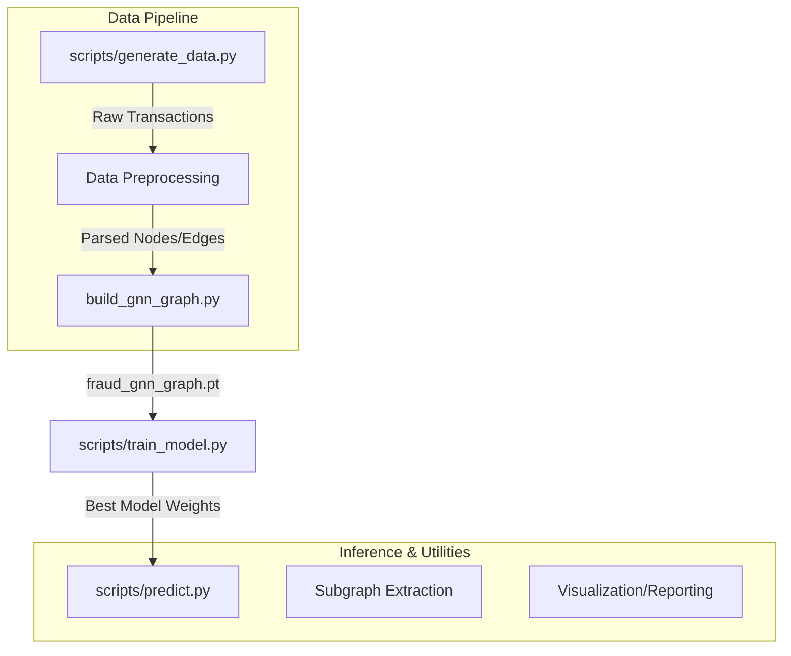

# 🛡️ IntelliTrace GNN: Anti-Money Laundering & Fraud Detection

Welcome to **IntelliTrace GNN**, a production-ready Graph Neural Network (GNN) pipeline specifically designed for Anti-Money Laundering (AML) and Banking Fraud Detection. 

This system uses PyTorch Geometric to represent bank accounts, mobile numbers, and geographical regions as heavily interconnected graph nodes, allowing for the immediate detection of multi-hop laundering chains, mule clusters, and fan-out structuring evasion tactics.

---

## ✨ Features

- **Synthetic Pattern Generation**: Capable of generating robust transactional datasets containing realistic fraud behaviors like Fan-In, Fan-Out, Structuring, and Fragmentation.
- **Heterogeneous Graph Architecture**: Nodes encompass Accounts, Names, Mobiles, and Pincodes, allowing the model to intrinsically map out Shared-Identity rings (mule rings).
- **Behavioral Node Embeddings**: Each node contains a highly engineered 12-dimensional vector profiling bursting logic, velocity, temporal gaps, and average amount structuring.
- **Targeted Loss Functions**: Implements **Focal Loss** handling steep class imbalances (fraud is often <20% of traffic).
- **Real-Time Subgraph Extraction**: Contains mathematical utilities to slice out localized $N$-hop subgraphs around incoming transactions, optimizing raw predictive throughput to milliseconds per transaction.

---

## 🏛️ System Architecture

Our repository follows a structured "Generate-Parse-Graph-Train" (GPGT) lifecycle:



---

## 🚀 Quick Start Guide

### 1. Installation

Requires Python 3.9+ and pip.

```bash
git clone https://github.com/your-org/intellitrace-gnn.git
cd intellitrace
pip install -r requirements.txt
```

### 2. Full Pipeline Execution
If you want to run the core predictive cycle end-to-end (training and evaluating):

```bash
# 1. Generate local synthetic transaction history with embedded fraud rules
python scripts/generate_data.py

# 2. Train the Multi-Layer GraphSAGE model against the network
python scripts/train_model.py

# 3. Predict incoming fraud risks and output reports
python scripts/predict.py
python scripts/generate_report.py
```

---

## 🔬 Subgraph Extraction & Mule Detection 
*(New in v2.0)*

Traditional GNNs evaluate the entire multi-million node graph per pass. IntelliTrace scales down to O(1) time complexity per transaction using localized **Neighborhood Subgraphs**.

Located in `src/utils/subgraph_extractor.py`, this tool utilizes PyTorch Geometric's `k_hop_subgraph` to dynamically isolate sender and receiver relationships down to the $N^{th}$ degree. 

**Visualizing Subgraphs Locally**:
```bash
python scripts/visualize_subgraph.py
```
This script traces a known money launderer outwards by exactly 2 network hops, saving a comprehensive map to `outputs/visualizations/2hop_subgraph_viz.png`.

---

## 🧠 Node Feature Mapping

A developer's most powerful tool here is the feature vector. Each account node's $x$ attribute is mathematically mapped using:

| Feature | Calculation Approach | Suspicious Behavior Logic |
| :--- | :--- | :--- |
| `out_degree` / `in_degree` | Total connections in/out | Excessive dispersals (Fan-out) or collections (Fan-in) |
| `unique_receivers` | Count distinct beneficiaries | "Shotgun pattern" dispersal algorithms |
| `avg_amount` / `std_amount` | Baseline + Variance | **Low Variance** = Structuring/Evasion limits  |
| `burst_score` | Count of txns < 60s apart | Bot automation / Scripted transferring |
| `mobile_shared` | Frequency sharing attributes | **High** = Identical operators orchestrating mules |
| `channel_div` | Unique channels (UPI, ATM, WEB) | Fragmentation evasion tactics |

---

## 🧪 Testing

We utilize standard Python unit testing to guarantee mathematical network extraction parameters (e.g. strict 2-hop radius clamping).

```bash
python -m unittest tests/test_subgraph_extractor.py
```

---

## 📁 Repository Structure

```text
intellitrace/
├── data/                    # Generated datasets and raw CSVs
├── models/                  # Saved .pth GraphSAGE checkpoint models
├── outputs/                 # HTML UI reports and NetworkX visualizations
├── scripts/
│   ├── generate_data.py     # Engine driving the synthetic 10-pattern fraud injector
│   ├── train_model.py       # PyTorch GraphSAGE orchestration
│   ├── predict.py           # Inference runtime
│   └── visualize_subgraph.py# 2-hop graph rendering module
├── src/
│   ├── utils/
│   │   └── subgraph_extractor.py # BFS PyG core slicing logic 
│   └── visualization/
│       └── graph_analysis.py    # Raw full-system plotting helpers
├── tests/
│   └── test_subgraph_extractor.py # Pytest/Unittest suite
└── README.md
```

---

*IntelliTrace: Illuminating the unseeable networks of global finance.* 🕵️‍♂️
